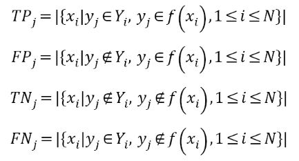
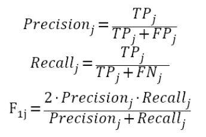

# 首届中国心电智能大赛--决赛阶段 Public Version

>说明  
>首届中国心电智能大赛决赛 公开发布版 网址 http://mdi.ids.tsinghua.edu.cn/  
>由于比赛自身的性质，本项目包含的内容仅限于本团队提出的最终决赛阶段的解决方案，任何有关数据的问题请直接与大赛主办方联系。

## 问题描述

>首先看下官方的描述

### 决赛赛题

各团队需要在决赛规定时间内，利用组委会提供的训练集和验证集数据，设计并实现模型和算法，预测常规心电图所代表的正常或异常类别。各团队在测试集上的预测结果将用于计算成绩。比赛中所使用的常规心电图类别主要有正常心电图，八种异常心电图（心房颤动、一度房室传导阻滞、右束支阻滞、左前分支阻滞、室性早搏、房性早搏、早复极图形改变和T波改变），以及“其他心电图”。“其他心电图”较广泛地覆盖了以上9类无法准确描述的心电图数据。

### 决赛数据情况

决赛数据分为训练集、验证集和测试集等三个部分。**注意**这里再重申一遍，由于比赛的方式，我们也仅限于比赛期间才具有部分数据的访问权，比赛结束后，选手没法接触到任何的数据，有任何与数据集访问使用下载等有关的问题请直接联系大赛主办方。

心电数据存为MAT格式。其中存储了12个导联的电压信号（包含了I, II, III, aVR, aVL, aVF, V1, V2, V3, V4, V5和V6），同时也包含了性别和年龄等变量。电压单位为毫伏，采样率为500赫兹。训练数据对应的标签存储在REFERENCE.csv文件中，各类别编号和英文缩写如下表所示。

| 编号 | 类别 | 英文缩写 |
| :------| :------: | :------: |
| 0 | 正常心电 | Normal |
| 1 | 心房颤动 | AF |
| 2 | 一度房室传导阻滞 | FDAVB |
| 3 | 完全性右束支阻滞 | CRBBB |
| 4 | 左前分支阻滞 | LAFB |
| 5 | 室性早搏 | PVC |
| 6 | 房性早搏 | PAC |
| 7 | 早期复极图形改变 | ER |
| 8 | T波改变 | TWC |
| 9 | 其它类别 | OTHERS |

### 评价指标

首先，针对第j个类别定义如下四个变量，其中0≤j≤9，

由此计算每一类的Precision、Recall和F1分数：

最后对10个类别得到的F1求平均，同时决赛阶段还加入了运行速度的要求以及算法创新性的要求，根据这三个点给出综合评分。

>好的，来谈一下自己的理解

### 赛题解读

根据对数据的了解的情况，这个问题可以定义为一个多标签分类问题，同时数据存在长度不一致，样本数量不平衡的问题需要注意考虑。

## 解决思路

决赛总体的思路考虑的是多个模型的融合，简要情况如下

1. 特征提取 + xgboost
2. raw ECG + Deeplearning
3. tf + Deeplearning
4. Ensemble

最终的结果上，几条思路得到的效果都一般，ensemble带来的提高并不多，甚至还有降低，所以本项目给出的代码仅仅包含第二条思路，这是总体上效果最好的一个。

## 代码说明

## 决赛结束之后

结束之后，考虑过几个问题

* 模型到0.8左右做不动了，这个模型的识别能力就到这里了
* 简单的加权 ensemble 的结果反而是decrease的

后续想想，可能的结果无非就是过拟合，欠拟合，以及两边的处理方式不一两个模型相当于提取的特征没法协同。以及后续想过一些继续提升的方案，

### 12导的处理方式

* 这个是之前就在一个博客看到过，他当时提到过这个问题，我没太当回事，也没想明白，自己这个网络是如何处理12导联的以及如果不一起处理又该怎么办。
* 现在想想，这可能确实是一个问题，之前我是把12导当成了向量表示，文本的embedding，但是现在想想这种向量表示有其相似程度的体现嘛，这个是文本的embedding去完成的东西。
* 首先一个，就是上升到二维以图片的形式卷积，但同时只沿时间维度strides，这样能保证尺度的一致，方便后续再加上lstm反映时间信息、注意力机制等
* 第二一个，对每一导联的单独训练，得到12个模型进行融合，相比于第一个还计算12导之间的信息，这个相当于直接先丢了，再深层的feature或者相当于最后的融合过程再去体现12导的关系
* 我觉得上面两个都是可供考虑的方案，但是没试过，后面才想到的。

### 后续的考虑点

* 滤波，对于12导联数据的滤波
* 定位，1985年的PanTompkins算法在异常的心电数据定位上，有多高的置信度呢？这个事情也是今年的icbeb challenge在做的事情，后续可关注其进展 [icbeb2019](http://www.icbeb.org/Challenge.html)
* 特征工程，关于特征的探讨

## 写在最后(Public 版)

这次比赛，12导联是一个挑战点，以及其它的一些小问题这次并没有处理得很好，从4月初开始接触深度学习这东西，到现在差不多4个月了吧，才算真正有了点了解。关于深度学习的学习就到此为止先告一段落，以大量时间作为投入得到产出和回报率太低了，再加上前路也再没有师兄师姐老师为我拨开迷雾了，这个还是消停了吧。

下面几句话吧，

> 不要重复造轮子，轮子直接用就行了，贼简单

* 我从不否认用轮子的简单，麻烦的地方是在于直接用轮子不能够解决问题，而造一个轮子难度很大。

> 问题如蜀道，踏上方知难

* 大大小小的问题，咋一看都没多大体会，真正着手开始搞了，才能有蜀道难，难于上青天的体会；但是难就不解决了嘛，把问题简化这个时候就显得很重要，上不了山顶，那就先爬到山腰再说；山腰都爬不到，那起码也先迈出去第一步再说。

这一路最难的其实是前路无指引，只能自己一个人默默前行，好在我倒是早已习惯了倒也没事，无非就是苦点累点慢一点，迟早都会到终点。  
当然，我自己还是会继续传达“不要重复造轮子，直接用就行了，很简单”的这个观点，因为以很多初学者的程度，轮子够使了，能把轮子用熟练了就足够牛逼了；而且只从**使用**轮子的角度来说，确实是很简单。  
我可能就是老把自己想得太厉害，才容易有那么多臭毛病，以我现在这点水平，还远远不到能够对造轮子人去品头论足的。  
另外，

## 写在最后(Private 版)

从holter的两导到这次的12导，之前的研究基础在这个时候几近束手无策，特征提取部分用到了1985年基于holter数据提出来的PanTompkins算法，然而这个定位方法，在异常的12导联数据上，有多高的置信度呢？
当然，这里面确实有着我先入为主的对传统方法的怀疑，但实际的结果确实如此，可能我没有找到它们合适的融合点吧。
但从这次比赛的结果来看，AI的确取得了普遍的胜利，虽然目前还不知晓其它队伍的具体方案，但应该是八九不离十的普遍AI。

## 参考材料&致谢

1. ICBEB2018 challenge的[比赛网址](http://2018.icbeb.org/Challenge.html)。  
本次有很多思路以及代码都源自于18年的这次比赛。

2. *小宋是呢*开源的一个初赛解决方案[Github](https://github.com/xiaosongshine/ECG_challenge_baseline_keras)  
当时这个方案可算是很多选手的入门指南了，自己也算从中才入了个门

3. 12处理方式里面提到的[csdn博客](https://blog.csdn.net/qq_15746879)  
这个人也进行了不少心电方面的研究，其一些思路上觉得是可供参考的

特此感谢以上的开源方案 ~ ，祝愿各位未来能取得更好的进展

指定图片大小的方式

    
